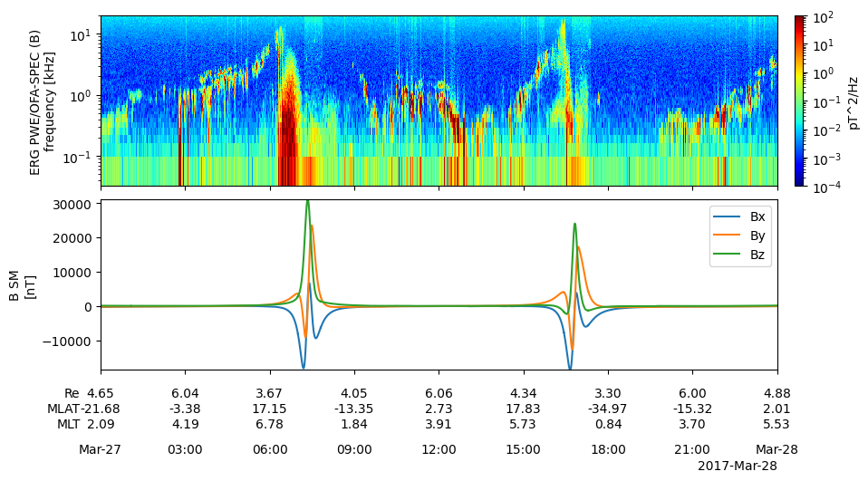
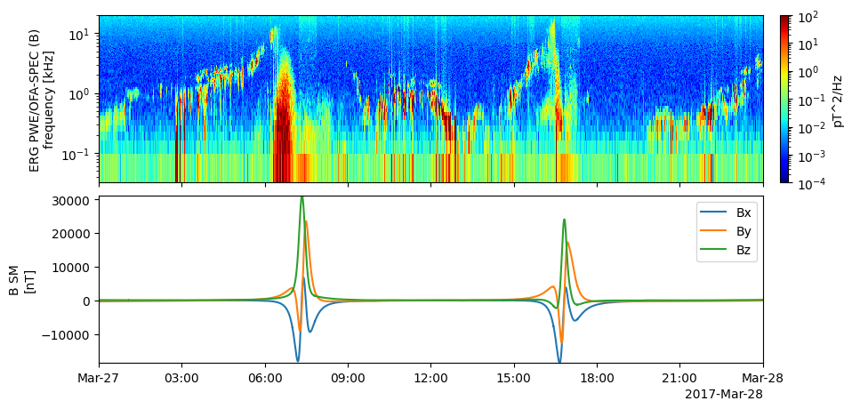
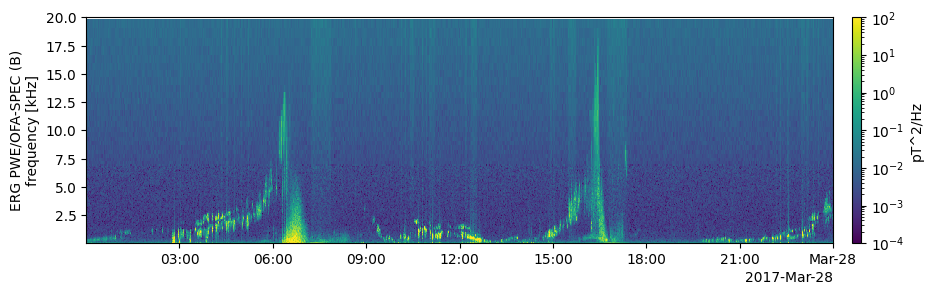
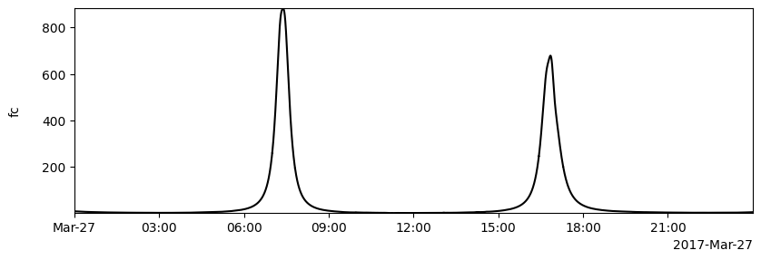
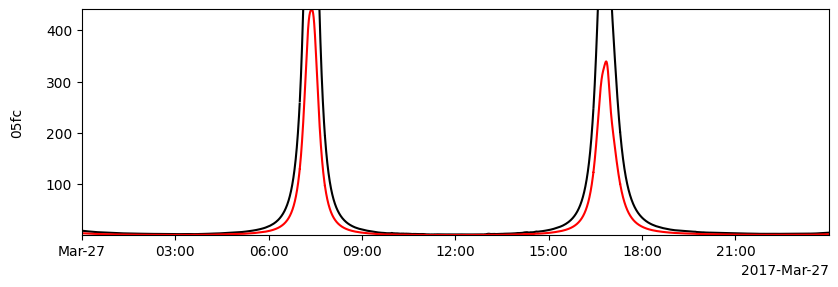
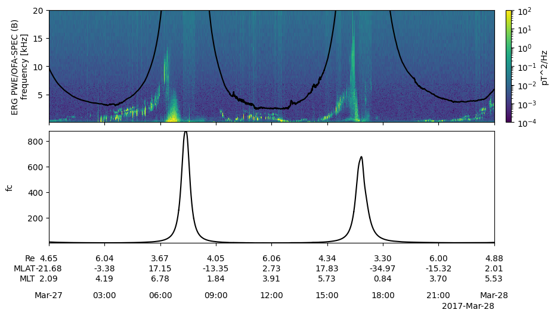

# stpp_tplot

Simple time series plotting library based on pyspedas and matplotlib.

## Overview

`stpp_tplot` is a Python library that provides convenient functions for plotting time series data, especially for space physics data processed by `pyspedas`. It simplifies the creation of publication-quality plots with features like:

* Multiple panel plots with shared x-axis
* Spectrogram plots with colorbar
* Orbit parameter labels panel
* Customizable plot options

## Installation

```bash
pip install stpp_tplot==0.1.7
```
## Usage
### Plotting with default options: mp
```python
from stpp_tplot import mp, sd, op
from pyspedas.erg import pwe_ofa, mgf, orb

# Load data
trange = ['2017-03-27', '2017-03-28']
pwe_ofa(trange=trange)
mgf(trange=trange)
orb(trange=trange)

# Plot data
mp(['erg_pwe_ofa_l2_spec_B_spectra_132', 'erg_mgf_l2_mag_8sec_sm'], var_label='erg_orb_l2_pos_rmlatmlt')
```


If you do not need the orbit parameter labels, var_label can be set to None.

```python
mp(['erg_pwe_ofa_l2_spec_B_spectra_132', 'erg_mgf_l2_mag_8sec_sm'], var_label=None)
```


### Plotting with custom options: op & mp
```python
op('erg_pwe_ofa_l2_spec_B_spectra_132', ylog=0, zlog=1, z_range=[1e-4, 1e2], colormap='viridis')
mp(['erg_pwe_ofa_l2_spec_B_spectra_132'], var_label=None)
```


Following are the available options for the `op` function:
 * y_label: y軸ラベル (yaxis_opt -> axis_label)
 * ylog: y軸タイプ (yaxis_opt -> y_axis_type)
 * y_range: y軸レンジ (yaxis_opt -> y_range)
 * axis_subtitle: y軸サブタイトル (yaxis_opt -> axis_subtitle)
 * z_range: z軸レンジ (zaxis_opt -> z_range)
 * zlog: z軸タイプ (zaxis_opt -> z_axis_type)
 * spec: spec 値 (extras -> spec)
 * colormap: colormap (extras -> colormap)
 * legend_names: legend_names (yaxis_opt -> legend_names)
 * line_color: line_color (line_opt -> line_color)
 * line_width: line_width (line_opt -> line_width)
 * line_style: line_style (line_opt -> line_style)

### Storing Data: sd
```python
from pyspedas import data_quants
import numpy as np
magt = data_quants['erg_mgf_l2_magt_8sec']
electron_mass = 9.1094e-31
electron_charge = 1.602e-19
fc = 1 / (2*np.pi) * electron_charge * magt * 1e-9 / electron_mass * 1e-3
sd('fc', data={'x': magt.time, 'y':fc})
sd('05fc', data={'x': magt.time, 'y':fc*0.5})
op('fc', line_color='black')
op('05fc', line_color='red')
mp('fc')
```


### Overplotting
Give the list of variables to be overplotted as a list of lists.
```python
mp([['fc', '05fc']])
```


```python
mp([['fc', 'erg_pwe_ofa_l2_spec_B_spectra_132'], 'fc'], var_label='erg_orb_l2_pos_rmlatmlt')
```
